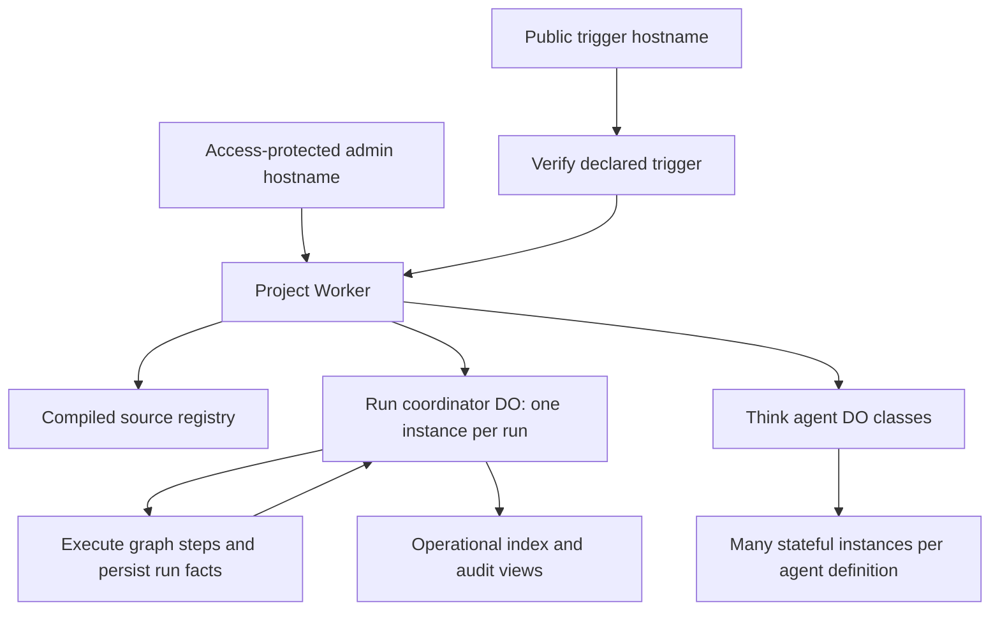

# RFD0002 - Clankwerk: Cloudflare-native agent and workflow projects

- Feature Name: `clankwerk-cloudflare-native`
- Status: Draft
- Scope: Cloudflare-native architecture and the typed graph DSL

## Summary

Clankwerk is a code-first, self-hosted-on-your-Cloudflare-account platform for agents and durable workflows. A developer scaffolds an independent project with `bunx @leostera/clankwerk new`, defines Think agents in `agents/*.ts` and workflow graphs in `workflows/*.ts`, and deploys with `bunx @leostera/clankwerk deploy`. The deploy command delegates to Cloudflare CLI (`cf deploy`). The deployed application serves an Access-protected operational dashboard at a chosen hostname and exposes separately authenticated public triggers on a dedicated hostname. Cloudflare Workers and Durable Objects are the runtime; local development uses Cloudflare's local runtime/Miniflare. There is no portable runtime or local SQLite backend.

This RFD describes the intended product. The initial implementation is summarized below; features not explicitly marked implemented remain design goals.

## Motivation

The typed graph DSL can describe workflows and render useful operational topology. But a portable scheduler, separate local and hosted databases, and manually assembled runtime/dashboard deployments make it harder to create an agent system that is useful immediately. Clankwerk should make the common path one project, one Cloudflare account, one deployment command, and an operational UI at the user's own domain.

Use cases:

1. Scaffold a project, choose `myclankwerk.leostera.dev`, and deploy a private dashboard without building an admin app or inventing a scheduler deployment.
2. Define a reusable research agent once, then operate multiple independently stateful instances of that Think agent.
3. Define a typed graph that runs in the background, survives Worker restarts, and is inspectable step by step.
4. Receive a GitHub webhook at `triggers.myclankwerk.leostera.dev`, verify its signature, and start a run without making the admin site public.
5. Inspect registered agents, workflow definitions, enabled triggers, runs, and an operational audit trail in one place.

## Guide-level explanation

### Create a project

```sh
bunx @leostera/clankwerk new
# prompts for project name, dashboard domain, and an existing Access allow policy;
# derives triggers.<domain> for public traffic
cd my-clankwerk
```

A generated project should be comprehensible without a hidden hosted Clankwerk control plane:

```text
my-clankwerk/
  agents/
    researcher.ts
  workflows/
    research-request.ts
  worker/
    main.ts
  cloudflare.config.ts
  package.json
```

The project owns its source, Cloudflare resources, secrets, and deployment. The package `@leostera/clankwerk` supplies the scaffold/CLI and authoring/runtime APIs; it does not run users' projects as a multi-tenant service. The exact package exports may be split internally without changing the single-package user experience.

`new` should collect and validate configuration, explain which Cloudflare resources will be created or reused, and produce deployable source. No Access users, identities, or identity providers are created by Clankwerk. Whether the CLI creates a self-hosted Access application using an existing policy or requires an existing application is an open implementation/policy decision. In either case, the admin hostname must not be exposed without verified Access protection.

### Author agents and workflows

Agent definitions live in source and are registered for build/deploy. Illustrative API (not a finalized Think wrapper signature):

```ts
// agents/researcher.ts
export default Clankwerk.defineAgent({
  id: "researcher",
  // Think model, instructions, tools, and lifecycle configuration
})
```

A definition is not an instance: `researcher` may have multiple independently addressable, stateful Think/Durable Object instances. The dashboard distinguishes agent definitions from instances and their activity. Clankwerk should use Cloudflare's Think harness rather than implement its own agent loop.

Workflow definitions live in `workflows/*.ts` and use Clankwerk's typed graph DSL. Node implementations remain in deployed code; durable state stores stable node/call-site IDs, inputs, attempt facts, outputs, and events—not closures. The authoring experience should support composition, branches, and dynamic fan-out where the retained DSL supports them. This RFD does not promise that every legacy execution feature survives unchanged.

The build registers source-defined agents, workflows, and triggers into a deployment manifest so the dashboard shows what this version of the project actually contains. Registration/discovery rules (default exports, named exports, explicit registry, or generated imports) must be made deterministic before implementation.

### Develop and deploy

```sh
# generated package.json scripts, conceptually
bun run dev       # Cloudflare local development, backed by Miniflare
bun run deploy    # cf deploy

# equivalent Clankwerk entry point
bunx @leostera/clankwerk deploy
```

`deploy` may perform validation/preflight and then delegate the actual application deployment to `cf deploy`; it must not grow a competing Cloudflare deploy implementation. Generated `cloudflare.config.ts` is the source of Cloudflare project configuration. Provisioning of domain routing, Access, storage, and other resources must be explicit and idempotent; `cf deploy` alone should not be assumed to establish security policy. The CLI must report what it changed and fail closed if the admin hostname cannot be verified as protected.

The Cloudflare CLI's programmatic configuration is currently beta and is loaded using Node rather than Bun. Invoking Clankwerk via `bunx` must not imply executing `cf`'s configuration loader under Bun; the generated project and CLI should pin compatible tooling and invoke `cf` with its supported runtime. Recheck the Cloudflare CLI contract during implementation.

### Operate

The admin hostname, for example `myclankwerk.leostera.dev`, is behind Cloudflare Access. Its UI/API show registered agent definitions, agent instances, workflow graphs, runs and per-step state, trigger configuration/status, and an audit/event timeline. UI actions that change state (such as disabling a trigger or starting a run) must identify the actor and produce audit records. The exact day-one set of operator actions remains open below.

The trigger hostname, for example `triggers.myclankwerk.leostera.dev`, is publicly reachable but is **not** an unauthenticated administration surface. Only declared trigger routes are served there. A public trigger must have explicit request verification appropriate to its source (for example, GitHub webhook signature verification using a secret); invalid requests cannot create runs. Keeping the hostnames separate permits different Access policies and makes accidental exposure easier to detect. Admin, operational API, agent-chat, and internal scheduler routes are never made public by a wildcard trigger exemption.



## Reference-level explanation

### Deployment and runtime boundaries

The initial architecture is one **Worker deployment** for a scaffolded project. That deployment may export multiple Durable Object classes and bind to other Cloudflare resources. A Worker deployment, a DO class, and a DO instance are different things: an agent definition maps to a Think-backed DO class/binding as required by the SDK, and its instance keys select distinct DO instances; a workflow definition is a source-level graph, while each **run** receives its own coordinator DO instance. No singleton DO serializes all workflow runs, and no separate Worker or DO class is required per workflow definition.

The Worker handles hostname-aware HTTP routing, static admin assets, authenticated admin API, public trigger verification, and entrypoints to DO-backed execution. The run coordinator DO owns the authoritative state machine and event ordering for that run, including step state, dependencies, attempts, retries, and recovery. It dispatches source-registered node implementations; operations that can outlive a request need explicit durable scheduling/recovery rather than a long-lived in-memory promise. Cloudflare Workflows is not the workflow engine in this proposal.

The scheduler is a logical component of the project Worker and its coordinator DOs, not a single global actor. The precise dispatch mechanism, concurrency controls, and recovery implementation require design and failure testing before production use. A run must be pinned to a compatible workflow definition version so a later deployment does not silently execute an old run with incompatible source. Deployment/version retention policy is unresolved; no guarantee of safe resumption across arbitrary code changes is implied.

### Discovery, indexing, and audit

Per-run DO storage cannot by itself provide an efficient global listing of all runs or agent instances. The project therefore needs a Cloudflare-native index for dashboard queries and durable trigger enablement state. **D1 is the proposed starting point** for queryable run/instance/deployment/trigger metadata and audit projection; run DO storage remains authoritative for the run state machine. The index is not a second scheduler. Build the projection with deterministic IDs and idempotent updates, and expose projection lag/repair rather than claiming cross-DO/D1 atomicity.

The audit UI must distinguish durable Clankwerk events (trigger accepted/rejected, run/step transitions, operator commands, deploy/definition changes where observable) from Cloudflare Access authentication logs. A global, complete, tamper-evident audit log is **not** guaranteed merely by using D1 projections. Required retention, completeness, and export guarantees are open questions; if strict auditing is a requirement, specify and test a stronger ingestion/retention path before claiming it.

Large binary artifacts or files should use R2 when needed, with references in durable run records; do not require R2 solely to scaffold an empty project. The same principle applies to provider bindings: provision only resources actually required for the baseline or selected features.

### Access and public triggers

The admin hostname must have a self-hosted Cloudflare Access application with an explicit allow policy for existing authorized identities. Scaffold/setup should inspect existing account configuration rather than creating users or IdPs, avoid broad implicit allow policies, and stop with actionable instructions if it cannot establish protection. Access enforcement must cover static assets, API, agent connections, and WebSocket/SSE upgrades—not just the dashboard HTML. Admin mutations must validate the authenticated actor and authorization server-side; client-side UI hiding is insufficient.

The public trigger hostname is routed to the same project Worker but is not covered by the admin Access application. Host routing is explicit; unexpected hosts/paths fail closed. Trigger definitions declare their route, verification mode, and workflow target. Secrets are Cloudflare-managed secrets, not committed scaffold output. A trigger's configured/enabled state is shown in the dashboard; disabling it prevents new runs without requiring a redeploy, if runtime toggles are included in the first release. Verification should include provider-specific signature checks, replay/idempotency protection where applicable, and input validation before accepting work. Do not add a universal unauthenticated webhook mode by default.

### Local development and tests

`dev` runs the Cloudflare Worker and DO bindings through Cloudflare's local tooling/Miniflare. Test the graph DSL in isolation and test project behavior in the Worker runtime: Access-gated routing (with explicit local auth simulation), public-host trigger separation, signature failures, DO instance isolation, restart/recovery, retries, fan-out, and index consistency. Local SQLite via `better-sqlite3` is not a supported alternative backend. Local emulation must not be presented as a complete test of Cloudflare Access, DNS, or deployed resource provisioning; deployment smoke tests cover those boundaries.

### Relationship to existing code

The graph authoring DSL and manifest compiler live in `@leostera/clankwerk`. Persistence and execution use Cloudflare primitives; there is no portable scheduler/database abstraction or local SQLite adapter. No compatibility with pre-Clankwerk persisted runs or packages is promised.

## Drawbacks

- Clankwerk deliberately depends on Cloudflare services and gives up runtime portability.
- `cf` and `cloudflare.config.ts` are beta; pinning and periodic compatibility work are necessary.
- Think's APIs and its required Worker/DO configuration may evolve.
- Per-run DO state plus a separate query index introduces eventual consistency and repair work.
- Durable step execution, retries, and deployments across source changes are still substantial engineering tasks.
- Two public DNS hostnames and Access provisioning complicate first deploy, but avoid making webhooks an exception to admin authentication.
- A self-hosted project cannot promise global audit completeness without explicitly designed ingestion and retention.

## Rationale and alternatives

- **One deployable project rather than a hosted Clankwerk control plane:** keeps ownership, billing, source, identities, and operational boundaries in the user's Cloudflare account.
- **One initial Worker deployment, many DO instances:** simplifies scaffolding while allowing run-level and agent-instance isolation. Split into multiple Workers only for a concrete isolation or scale requirement.
- **Per-run coordinator rather than per-workflow singleton:** independent runs do not contend on one coordinator. Workflow definitions stay in source; run facts are durable.
- **Own graph scheduler rather than Cloudflare Workflows:** preserves the graph DSL's topology and Clankwerk-specific run/event semantics without compiling onto a second workflow abstraction.
- **Think for agents:** leverages a Cloudflare-native, DO-backed agent harness instead of building another chat/tool/memory loop.
- **D1 index rather than one global index DO:** serves list/filter queries without turning every run into traffic for a singleton coordinator. Projection and audit tradeoffs must remain explicit.
- **Separate trigger hostname rather than Access bypass paths on the admin hostname:** reduces the chance that a route change exposes privileged APIs.

## Prior art

Typed graph schedulers inform topology identity and durable run execution. Cloudflare Workers provide deployment and HTTP handling; Durable Objects provide coordinated per-run and per-agent-instance state; Think provides the agent harness; Access protects the admin surface; Miniflare supplies local Cloudflare runtime emulation.

## Unresolved questions

1. **Access onboarding:** should `new` attach an existing reusable Access policy to a newly created self-hosted application, select an existing application, or support both? What is the exact fail-closed first-deploy flow when no suitable policy exists?
2. **Day-one admin actions:** inspection only, or start/cancel/retry workflows, enable/disable triggers, create/name agent instances, and chat with them? Which actions need distinct roles?
3. **Graph runtime:** exact DO scheduling/recovery protocol, concurrency bounds, retry semantics, external side-effect idempotency, fan-out execution, and crash-safe step commits.
4. **Version compatibility:** how do in-progress runs resolve source-compatible step implementations across deployments, and when is deployment blocked versus a run marked incompatible?
5. **Discovery:** how are file exports registered deterministically, how are IDs derived, and how are DO bindings/migrations generated for registered Think agent definitions?
6. **Audit guarantees:** what must be retained, for how long, and must rejected triggers, deployments, and authorization failures appear alongside execution facts?
7. **Public trigger policy:** which built-in signature schemes ship first, whether unverified triggers can ever be explicitly enabled, and how trigger-host routing is provisioned/verified.
8. **Operational storage:** whether D1 is sufficient for search/list and audit projections, how index repair works, and when R2 is needed for artifacts.
9. **CLI delivery:** how `bunx` delegates reliably to a Node-run `cf` CLI, what privileges provisioning needs, and how to validate domain, DNS, Access, and DO resources without surprising side effects.

## Future possibilities

- Additional Worker deployments for strong isolation or independently scalable ingress and execution.
- R2-backed artifact provenance and downloads.
- Live run/agent activity streams, cost and model usage, and deeper traces.
- Provider-specific trigger adapters and richer policy-controlled operator actions.
- Safe run migration/replay across compatible definition versions.
- Structured audit export to dedicated retention infrastructure.

## Initial implementation checkpoint

The root `@leostera/clankwerk` package contains the migrated graph DSL and manifest compiler, a `new`/`deploy` CLI, and a Cloudflare project template. The template builds with `cf` and provides a Think-backed agent class, a per-run DO coordinator for static graph steps, a D1 run/audit query projection, host-separated Hono routing, and a read-only React/Vite operations dashboard. The scaffold takes one `--domain` and derives `triggers.<domain>`. `clankwerk setup` can provision a self-hosted Access application using an existing reusable allow policy, while the generated deployment script verifies protection and delegates to `cf deploy`. No public triggers are enabled by default.

This is a foundation, **not completion of this RFD**: admin mutation actions, complete agent-instance indexing, audited and signed public triggers, dynamic fan-out, robust in-flight execution fencing, and historical definition compatibility remain to be implemented. The dashboard searches loaded definitions/recent runs, shows source-manifest workflow graphs, authoritative run details, and browser-local appearance settings. The protected `hello-api` entrypoint records accepted starts in D1, and workflow-mediated `context.callAgent(...)` invocations record per-run/per-step agent lineage; `hello` itself does not call `researcher`. Neither direct agent sessions nor bypassed calls are indexed. Rejected trigger attempts, public webhook executions, OpenTelemetry spans, and a complete audit trail are not claimed. The legacy runtime and its examples have been removed from the repository.

## Rollout and acceptance criteria

1. Scaffold a new project with one chosen dashboard hostname, a derived trigger hostname, and an explicit Access setup path; no default-public admin endpoint.
2. Run it locally with Cloudflare's Worker/DO runtime without starting the old local SQLite server.
3. Register one Think agent definition, create two isolated instances, and inspect both in the dashboard.
4. Register a graph workflow, start two concurrent runs, and recover in-progress work without re-running completed steps incorrectly.
5. Reject unsigned or invalid public webhook requests; accept a valid signed request and show its run and audit events.
6. Deploy through `cf deploy`; confirm authorized users can reach admin UI/API and unauthenticated users cannot, while the trigger host exposes only declared, verified routes.
7. Demonstrate restart/deploy compatibility behavior explicitly, including the documented failure mode for an incompatible definition.
